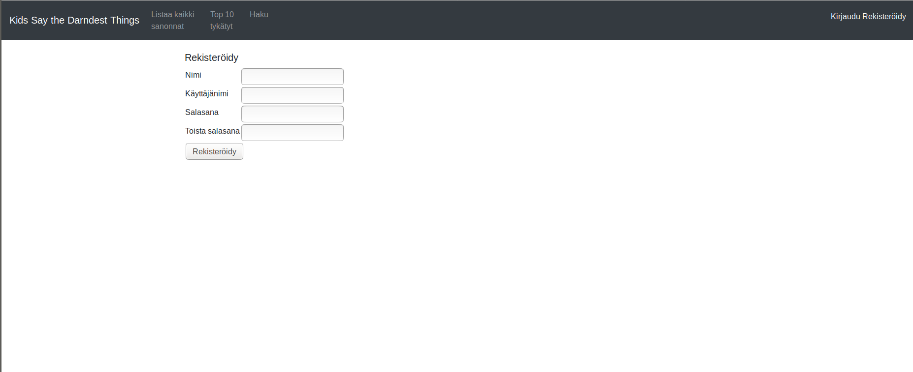
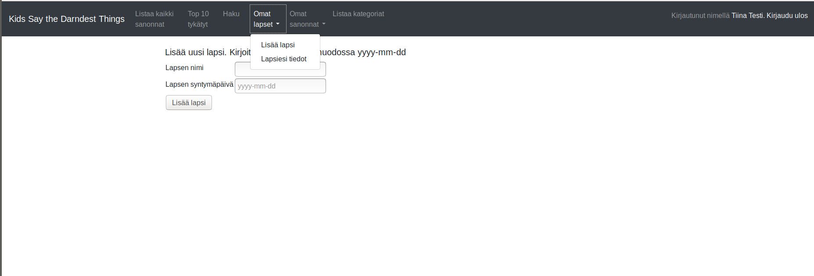
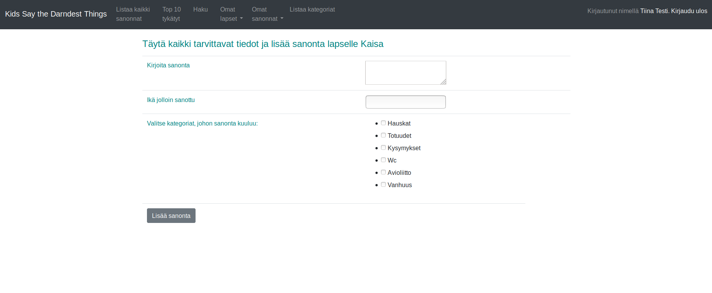
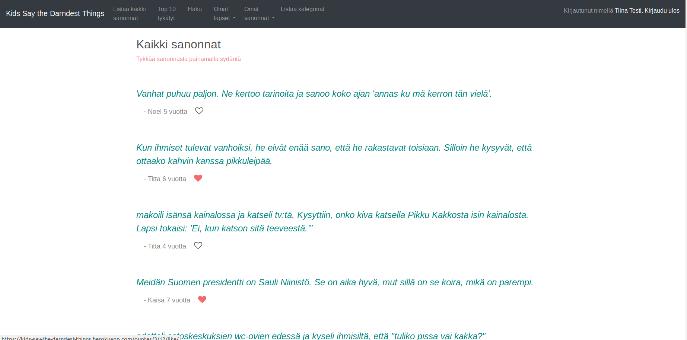
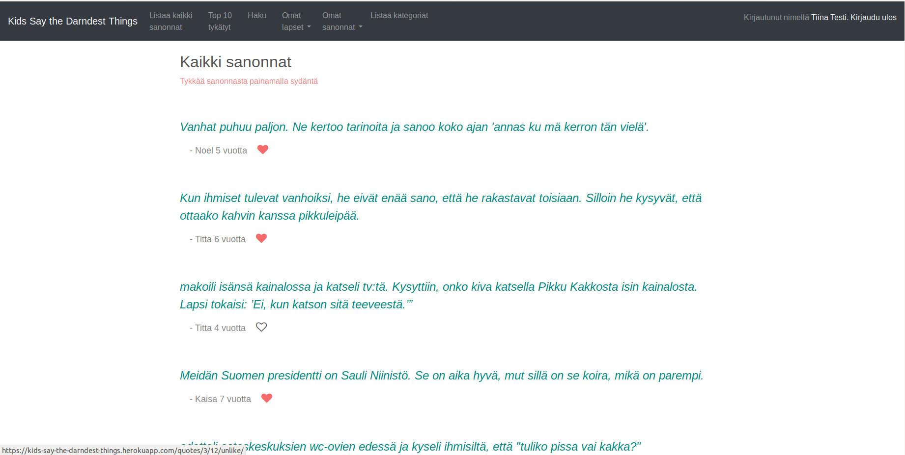
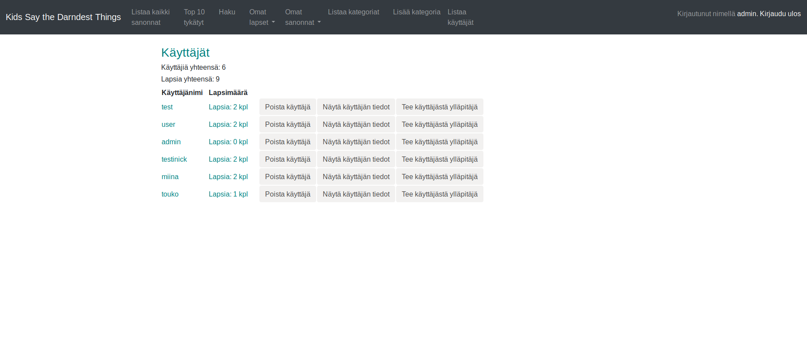

# Käyttöohje

Sovelluksessa on mahdollista lisätä lapsiensa sanontoja talteen itselleen. Sovelluksessa myös voi julkisesti lukea erilaisia sanontoja tai listata niitä eri kategorioittain. 

Aloitussivulta pääseen lukemaan listausta sanonnoista tai hakemaan niitä kategorioittain kirjautumatta. Muihin näkymiin ja toimintoihin pääseminen vaatii kirjautumisen. Kirjautumaan pääsee sivun oikeassa yläkulmassa olevasta kohdasta "Kirjaudu".

### Kaikki käyttäjät

Kaikki käyttäjät pääsevät listaamaan kaikkien lasten sanonnat ylävalikosta kohdasta "Listaa kaikki sanonnat". Top 10 tykätyt kohdasta pääsee lukemaan 10 eniten tykättyä sanontaa. Haku kohdasta on mahdollista valita kategoria ja tämän jälkeen näkyvät valitun kategorian sanonnat. 

#### Rekisteröityminen

Rekisteröitymissivulla on mahdollista luoda uusi asiakastili ja sinne pääsee aloitussivun oikeasta yläkulmasta kohdasta "Rekisteröidy". Vaaditut kentät ovat 
- nimi. Pakollinen, 2-30 merkkiä pitkä.
- käyttäjätunnus. Pakollinen, 2-20 merkkiä pitkä. 
- salasana. Pakollinen, vähintään 8 merkkiä pitkä.

Jos pääkäyttäjää (admin) ei ole vielä luotu, sen voi luoda rekisteröitymällä ja antamalla käyttäjätunnukseksi admin sekä valitsemalla itse haluamansa salasanan.

#### Kirjautuminen

Kun käyttäjä on rekisteröitynyt, voi hän kirjautua sovellukseen. Kirjautumisessa tulee syöttää luotu käyttäjänimi sekä salasana. Kirjautumaan pääsee ylävalikosta $

### Rekisteröitynyt ja kirjautunut käyttäjä 

#### Omien tietojen näyttäminen ja muokkaaminen

Omia tietojaan pääsee tarkastelemaan yläpalkin valikosta oikealta painamalla oman nimensä kohdasta. Tiedoissa näkyy id, nimi, käyttäjänimi, luomispäivä, muokkaamispäivä sekä lapsien listaus. Painikkeesta "Muokkaa tietoja tai vaihda salasana" pääsee vaihtamaan nimen, käyttäjänimen ja/tai salasanan. 

#### Lapsen lisääminen

Kirjautunut käyttäjä voi lisätä itselleen lapsia yläpalkin valikon kohdasta "Omat lapset" ja valitsemalla "Lisää lapsi". Lapselle tulee syöttää seuraavat tiedot:
- nimi. Pakollinen, 2-30 merkkiä pitkä.
- syntymäpäivä. Pakollinen, muodossa yyyy-mm-dd.

#### Lapsien listaus 

Kaikki omat lisätyt lapset pääsee näkemään yläpalkin valikon kohdata "Omat lapset" ja valitsemalla lapsiesi tiedot. Lapsien listauksessa näkyy lapsen nimi ja syntymäpäivä sekä painikkeet eri toiminnoille. Painikkeesta "Näytä lapsen tarkemmat tiedot" pääsee tarkastelemaan lisäksi esimerkiksi luomis ja muokkaamispäiviä. Painikkeesta "Muokkaa lapsen tietoja" pääsee muokkaamaan Lapsen nimeä tai syntymäpäivää. Poisto painike poistaa lapsen. Tästä tulee vielä varmistuskysely, jottei lasta ja hänen kaikkia sanontojaan tule poistettua vahinkopainalluksella.
 

#### Sanontojen lisäys 

Jotta sanonta voidaan lisätä, on ylläpitäjän täytynyt lisätä sovellukseen valmiiksi kategorioita.

Sanonta voidaan lisätä vain luodulle lapselle. Sanonnassa tulee täyttää seuraavat tiedot:
- Sanonta. Pakollinen, pituuden tulee olla vähintään 5 merkkiä.
- Ikä, jolloin sanonta on sanottu. Pakollinen, luvun tulee olla välillä 0-99.
- Kategoriat. Pakollinen, sanonnalle tulee valita yksi tai useampi kategoria.

Ylävalikosta kohdasta "Omat sanonnat" pääsee valitsemaan haluaako lisätä uuden sanonnan vai tarkastella olemassaolevia sanontoja. 

 
#### Lapsen sanontojen listaus

Lapsen omat sanonnat voidaan listata valitsemalla ylävalikosta "Omat sanonnat" ja tämän jälkeen lapsi, jonka sanonnat halutaan listata. Tästä päästään listaukseen, jossa on listattuna lapsen sanonnat, kussakin ikä jolloin sanonta on sanottu ja valintapainikkeet. Sanontaa voidaan muokata painikkeesta "Muokkaa", jolloin päästään sanonnan lomakkeeseen. Tähän täytyy syöttää samat tiedot pakollisena, kuin sanontaa lisätessä. 

Painikkeesta "Näytä sanonnan tarkemmat tiedot" päästään tarkastelemaan sanontaa tarkemmin. Näkymästä nähdään sanonta, luomisaika, muokkausaika, sanomisikä sekä sanonnalle lisätyt kategoriat. 

Poista painikkeesta sanonta voidaan poistaa.  

#### Sanonnasta tykkääminen

Kaikkien lasten sanonnat nähdään ylävalikon painikkeesta "Listaa kaikki sanonnat". Lapsen iän ja nimen perässä on sydän, jota painamalla voidaan tykätä sanonnasta. Kun sanonnasta on tykätty, sydän muuttuu punaiseksi. Tykkäys voidaan poistaa painamalla sydämestä uudelleen. 

 

#### Kategorioiden listaaminen

Kaikki olemassaolevat kategoriat on mahdollista listata näkyviin ylävalikon kohdasta "Listaa kategoriat"

### Pääkäyttäjä

#### Kategorian lisäys, listaus ja poisto

Pääkäyttäjä voi lisätä kategorioita yläpalkin valikosta "Lisää kategoria". Kategorialle tulee antaa nimi ja painaa lisää nappia. Ylävalikon kohdasta "Listaa kategoriat" pääsee lisättyjen kategorioiden listaukseen. Pääkäyttäjän näkymässä on kategorian perässä poista nappi, josta kategorian voi poistaa. Kategorian muokkaustoiminto on jätetty pois, jottei sanonnoille lisättyjen kategorioiden nimityksiä enää vaihdettaisi (edes ylläpitäjän toimesta).

#### Sanonnan poisto

Pääkäyttäjän on mahdollista poistaa kenen tahansa lisäämiä sanontoja. Kaikki sanonnat pääsee listaamaan kuten tavallinenkin käyttäjä, sanonnan perässä on poista nappi, josta sanonnan voi poistaa.

#### Käyttäjien listaaminen ja näyttäminen

Pääkäyttäjän on mahdollista listata kaikki sovelluksessa olevat käyttäjät kohdasta "Listaa käyttäjät". Näkyviin tulee listauksessa käyttäjän käyttäjänimi sekä lapsimäärä. Painikkeesta "näytä käyttäjän tiedot" päästään tarkastelemaan käyttäjän kaikkia tietoja. Näkymässä näkyy myös käyttäjän lapset. 

#### Käyttäjän poistaminen

Pääkäyttäjän on mahdollista poistaa käyttäjiä. Tämä tapahtuu painamalla "Poista käyttäjä" painiketta käyttäjälistauksessa. Poistosta pyydetään vielä varmistus, jottei käyttäjää, kaikkia hänen lapsiaan ja lapsiensa sanontoja tule poistettua vahinkopainalluksella. 
