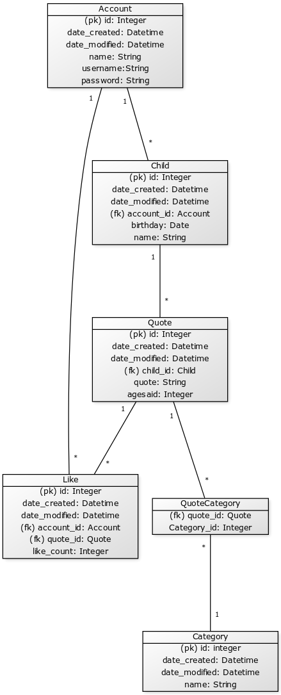

# Tietokanta- ja arkkitehtuurikuvaus

### Yleiskuvaus

Toteututettu käyttäen Herokun PostreSQL tietokantaa, Python, HTML ja Boostrapia ulkoasun tyylittelyssä. Kaikki riippuvuudet on löytettävissä [requirements.txt](https://github.com/millalin/Kids-Say-the-Darndest-Things/blob/master/requirements.txt) tiedostosta. Sovelluksen keskeisimmät riippuvuudet ovat Flask, SQLAlchemy sekä Jinja2. 

Ohjelman käyttäroolit ovat ylläpitäjä, rekisteröitynyt käyttäjä ja rekisteröimätön käyttäjä. Näiden kuvaukset löytyvät [user stories](https://github.com/millalin/Kids-Say-the-Darndest-Things/blob/master/documentation/kayttotapaukset.md) -osiosta. 

### Tietokantakaavio

Toiminnot tauluittain ovat:

Toiminnot ovat kirjautuneelle käyttäjälle, ellei toisin mainita.

Käyttäjä (CRUD)

- käyttäjän rekisteröityminen, tunnusten luominen (kaikki käyttäjät)
- rekisteröityneen käyttäjän kirjautuminen 
- kaikkien käyttäjien listaus (vain admin)
- käyttäjän tietojen tarkastelu 
- Käyttäjän tietojen muokkaaminen
- käyttäjän poisto 
- kaikkien käyttäjien poistomahdollisuus (vain admin)

Lapsi (CRUD) 

- lapsen lisäys
- lapsen tietojen muokkaus
- lapsen tietojen tarkastelu
- lapsen poisto

Sanonta (CRUD)

- sanonnan lisääminen 
- sanonnan muokkaus
- kaikkien lasten sanontojen listaus (myös ei kirjautunut)
- omien lasten sanontojen listaus
- omien lasten sanonnan poisto
- kaikkien sanontojen poistomahdollisuus (vain admin)
- sanonnan listaus kategorian mukaan (myös ei kirjautunut)
- sanonnan listaus iän mukaan (myös ei kirjautunut)

Kategoria (CRUD)

- kategorian lisäys (vain admin)
- kategorian poisto (vain admin)
- kategorian muokkaus ja tarkempien tietojen näyttäminen (vain admin)
- kaikkien kategorieoiden listaus

Tykkäys (CD)

- tykkäyksen lisääminen sanonnalle
- tykkäyksen poisto
- top 10 tykätyt lista (myös ei kirjautunut)

### Tietokannan normalisointi

Tietokanta on pääsääntöisesti normaalimuodossa. Sanonnassa on jätetty lapsen ikä sanonnan tauluun, sillä tämä näytetään useissa listauksissa ja sanonnan ikää ei voida laskea lapsen syntymäpäivästä, sillä vanhempi saattaa lisätä ja muokata sanontoja myöhemminkin, eikä reaaliaikaisesti. Sanonnan päivämäärän syöttämisellä (lomakkeessa ikä, jollion sanottu sijasta olisi päivämäärä, jolloin sanottu), oltaisiin voitu laskea lapsen syntymäpäivästä ikä, mutta käyttäjän kannalta mielekkäämmäksi ajateltiin vain lapsen iän ilmoittaminen. 

### Tietokannan CREATE TABLE -lauseet

#### Account

    CREATE TABLE account (
   	    id INTEGER NOT NULL, 
   	    date_created DATETIME, 
   	    date_modified DATETIME, 
   	    name VARCHAR(144) NOT NULL, 
   	    username VARCHAR(144) NOT NULL, 
   	    password VARCHAR(144) NOT NULL, 
   	    role VARCHAR(20) NOT NULL, 
   	    PRIMARY KEY (id)
  	    )

#### Child

    CREATE TABLE child (
        id INTEGER NOT NULL, 
        date_created DATETIME, 
        date_modified DATETIME, 
        name VARCHAR(20) NOT NULL, 
        birthday DATE NOT NULL, 
        account_id INTEGER NOT NULL,
        PRIMARY KEY (id), 
        FOREIGN KEY(account_id) REFERENCES account (id)
        )

#### Quote

    CREATE TABLE quote (
  	    id INTEGER NOT NULL, 
  	    date_created DATETIME, 
   	    date_modified DATETIME, 
  	    quote VARCHAR(2000) NOT NULL, 
  	    agesaid INTEGER NOT NULL, 
  	    child_id INTEGER NOT NULL, 
 	    PRIMARY KEY (id), 
  	    FOREIGN KEY(child_id) REFERENCES child (id)
	    )

#### Category

    CREATE TABLE category (
  	    id INTEGER NOT NULL, 
  	    date_created DATETIME, 
  	    date_modified DATETIME, 
  	    name VARCHAR(20) NOT NULL, 
  	    PRIMARY KEY (id)
	)

#### Likes

    CREATE TABLE likes (
  	    id INTEGER NOT NULL, 
   	    date_created DATETIME, 
   	    date_modified DATETIME, 
   	    account_id INTEGER NOT NULL, 
   	    quote_id INTEGER NOT NULL, 
   	    like_count INTEGER NOT NULL, 
   	    PRIMARY KEY (id), 
   	    FOREIGN KEY(account_id) REFERENCES account (id), 
   	    FOREIGN KEY(quote_id) REFERENCES quote (id)
	    )

#### Quotecategory 

    CREATE TABLE quotecategory (
  	    quote_id INTEGER NOT NULL, 
   	    category_id INTEGER NOT NULL, 
   	    PRIMARY KEY (quote_id, category_id), 
   	    FOREIGN KEY(quote_id) REFERENCES quote (id), 
   	    FOREIGN KEY(category_id) REFERENCES category (id)
	    )

### Ohjelman rakenteeseen jääneet heikkoudet ja jatkokehitysideat

- lapsilla voi olla tällä hetkellä vain yksi käyttäjätili (vanhempi). Tätä voisi muokata niin, että samoille lapsille voisi olla muitakin käyttäjiä (toinen vanhempi, isovanhempi tms) ja olisi mahdollista myös esimerkiksi tarkastella, kuka on lisännyt minkäkin sanonnan lapselle. 
- lapsen lisäyksessä syntymäpäivän kohdalla voisi olla kalenterivalikko, josta päivämäärän voisi valita, nyt syöttäminen täytyy tehdä tietyssä muodossa
- sivutuksessa voisi olla numerointi myös monta sivua, jotta voisi navigoida suoraan jollekin sivustolle (esimerkiksi nro 5)
- haun voisi toteuttaa lisäksi myös esimerkiksi niin, että se hakisi sekä ikällä että kategorialla. Lisäksi oman lapsen sanonnoissa voisi olla ikähakutoiminto.
